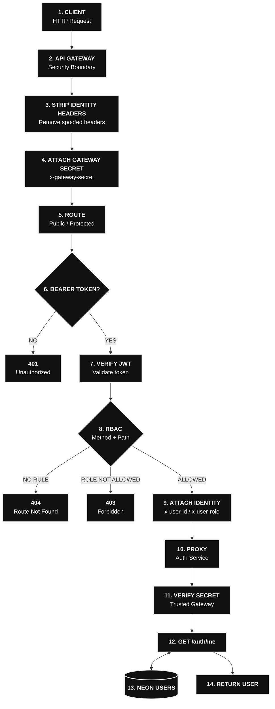

# Project Structure

This project is organized as a **monorepo** containing multiple backend services, shared packages, database migrations, Docker configuration, and development scripts.

```text
project-root/
│
├── apps/                              # Application services
│   │
│   ├── api-gateway/                   # API entry point / request routing
│   │   ├── src/
│   │   │   ├── middleware/
│   │   │   │   └── gateway.auth.ts
│   │   │   ├── rbac.ts
│   │   │   └── index.ts
│   │   ├── package.json
│   │   └── tsconfig.json
│   │
│   ├── auth-service/                  # Authentication & authorization
│   │   ├── src/
│   │   │   ├── controllers/
│   │   │   ├── repositories/
│   │   │   ├── routes/
│   │   │   ├── services/
│   │   │   ├── utils/
│   │   │   ├── schemas/
│   │   │   ├── types/
│   │   │   └── index.ts
│   │   ├── package.json
│   │   └── tsconfig.json
│   │
│   ├── media-service/                 # Media / attachment operations
│   │   ├── src/
│   │   │   ├── controllers/
│   │   │   ├── repositories/
│   │   │   ├── routes/
│   │   │   ├── services/
│   │   │   ├── utils/
│   │   │   ├── schemas/
│   │   │   ├── middleware/
│   │   │   └── index.ts
│   │   ├── package.json
│   │   └── tsconfig.json
│   │
│   ├── task-service/                  # Task management
│   │   ├── src/
│   │   │   ├── controllers/
│   │   │   ├── repositories/
│   │   │   ├── routes/
│   │   │   ├── services/
│   │   │   ├── utils/
│   │   │   ├── schemas/
│   │   │   ├── kafka.ts
│   │   │   └── index.ts
│   │   ├── package.json
│   │   └── tsconfig.json
│   │
│   └── workflow-service/              # Workflow management
│       ├── src/
│       │   ├── controllers/
│       │   ├── repositories/
│       │   ├── routes/
│       │   ├── services/
│       │   ├── utils/
│       │   └── index.ts
│       ├── package.json
│       └── tsconfig.json
│
├── packages/
│   └── shared/                        # Shared libraries used by services
│       ├── src/
│       │   ├── auth/
│       │   │   ├── gateway.auth.ts
│       │   │   ├── jwt.ts
│       │   │   └── types.ts
│       │   │
│       │   ├── db/
│       │   │   └── pool.ts
│       │   │
│       │   ├── errors/
│       │   │   ├── AppError.ts
│       │   │   └── errorHandler.ts
│       │   │
│       │   ├── kafka/
│       │   │   ├── client.ts
│       │   │   ├── consumer.ts
│       │   │   ├── fetchAllActiveTopics.ts
│       │   │   ├── fetchAllMessages.ts
│       │   │   ├── producer.ts
│       │   │   └── topics.ts
│       │   │
│       │   ├── logger/
│       │   │   ├── httpLogger.ts
│       │   │   └── logger.ts
│       │   │
│       │   ├── response/
│       │   │   └── response.ts
│       │   │
│       │   └── validation/
│       │       └── validateBody.ts
│       │
│       ├── package.json
│       └── tsconfig.json
│
├── docker/
│   └── compose.yml                    # Local infrastructure
│
├── scripts/
│   └── db-migrate.ts                  # Database migration runner
│
├── sql/                               # Database migrations
│   ├── 001_users.sql
│   ├── 002_tasks.sql
│   ├── 003_attachments.sql
│   └── 004_workflows.sql
│
├── .env                               # Environment configuration
├── .env.keys                          # Gitignored environment keys
├── .gitignore
├── eslint.config.js
├── load-test.js                       # Load testing
├── package.json
├── package-lock.json
└── tsconfig.base.json                 # Shared TypeScript configuration
```

## Architecture Overview

```text
                              ┌──────────────────────┐
                              │      API Gateway     │
                              │                      │
                              │ Auth Middleware      │
                              │ RBAC                 │
                              │ Request Routing      │
                              └──────────┬───────────┘
                                         │
              ┌──────────────────────────┼──────────────────────────┐
              │                          │                          │
              ▼                          ▼                          ▼
      ┌───────────────┐          ┌───────────────┐          ┌───────────────┐
      │ Auth Service  │          │ Media Service │          │ Task Service  │
      │               │          │               │          │               │
      │ Controllers   │          │ Controllers   │          │ Controllers   │
      │ Services      │          │ Services      │          │ Services      │
      │ Repositories  │          │ Repositories  │          │ Repositories  │
      │ Routes        │          │ Routes        │          │ Routes        │
      └───────┬───────┘          └───────┬───────┘          └───────┬───────┘
              │                          │                          │
              │                          │                          │
              └──────────────────────────┼──────────────────────────┘
                                         │
                                         ▼
                              ┌──────────────────────┐
                              │  Workflow Service    │
                              │                      │
                              │ Controllers          │
                              │ Services             │
                              │ Repositories         │
                              │ Routes               │
                              └──────────┬───────────┘
                                         │
                    ┌────────────────────┼────────────────────┐
                    │                    │                    │
                    ▼                    ▼                    ▼
             ┌─────────────┐      ┌─────────────┐      ┌─────────────┐
             │ PostgreSQL  │      │    Kafka    │      │    Shared   │
             │             │      │             │      │   Package   │
             │ Database    │      │ Messaging   │      │             │
             └─────────────┘      └─────────────┘      └─────────────┘
```

## Shared Package

The `packages/shared` package contains infrastructure and utilities shared across services.

| Module       | Responsibility                                                     |
| ------------ | ------------------------------------------------------------------ |
| `auth`       | JWT authentication, authorization types, gateway authentication    |
| `db`         | Database connection pooling                                        |
| `errors`     | Application errors and centralized error handling                  |
| `kafka`      | Kafka clients, producers, consumers, topics, and message utilities |
| `logger`     | Application and HTTP logging                                       |
| `response`   | Standardized API responses                                         |
| `validation` | Request body validation                                            |

## Service Architecture

Each service follows a similar layered structure:

```text
                    HTTP Request
                         │
                         ▼
                    ┌─────────┐
                    │ Routes  │
                    └────┬────┘
                         │
                         ▼
                 ┌──────────────┐
                 │ Controllers  │
                 └──────┬───────┘
                        │
                        ▼
                  ┌───────────┐
                  │ Services  │
                  └─────┬─────┘
                        │
             ┌──────────┴──────────┐
             │                     │
             ▼                     ▼
      ┌──────────────┐      ┌──────────────┐
      │ Repositories │      │ Shared Utils │
      └──────┬───────┘      └──────────────┘
             │
             ▼
       ┌────────────┐
       │ PostgreSQL │
       └────────────┘
```

### Typical Request Flow

```text
Client
  │
  │ HTTP Request
  ▼
API Gateway
  │
  ├── Authentication
  ├── Authorization / RBAC
  └── Route Resolution
          │
          ▼
     Service API
          │
          ▼
     Controller
          │
          ▼
      Service
          │
      ┌───┴────┐
      ▼        ▼
Repository   Kafka
      │        │
      ▼        ▼
 PostgreSQL  Events
```


## Authentication & Authorization Flow



